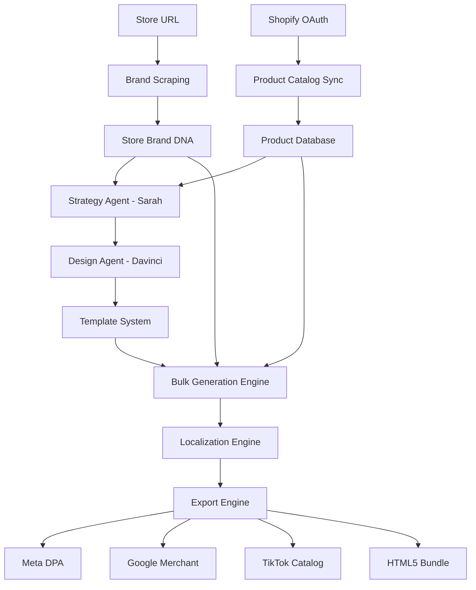

# Product Catalog Integration - Implementation Plan

**Vision:** Transform GridLite from a brand-level ad generator into a **product-catalog advertising platform** that creates thousands of personalized, localized ads automatically from e-commerce data while maintaining store brand identity.

## Executive Summary

### Current State

- **Scope:** Single brand campaign per workflow
- **Input:** Website URL → Brand scraping
- **Output:** Static brand awareness ads
- **Scale:** 1 campaign at a time

### Target State

- **Scope:** Product catalog campaigns at scale
- **Input:** Website URL (store brand) + Shopify catalog (products)
- **Output:** Dynamic product ads (DPA), localized variations, bulk exports
- **Scale:** 1,000+ ads from single store connection

### Key Features

1. **Shopify Integration:** OAuth connection, product catalog sync
2. **DPA Generation:** Template-based ads with dynamic product data
3. **Localization:** Multi-market campaigns (currency, language, cultural adaptation)
4. **Bulk Export:** Platform-specific formats (Meta, Google, TikTok)
5. **Store Brand DNA:** Maintain brand consistency across all product ads

---

## Technical Architecture

### System Overview



### Data Flow

```
┌─────────────────────────────────────────────────────────┐
│ LAYER 1: Store Brand Identity (One-time)               │
│ ─────────────────────────────────────────               │
│ Input: store.com                                        │
│ Process: Brand scraping (existing)                      │
│ Output: BrandContext {logo, colors, fonts, voice}       │
└─────────────────────────────────────────────────────────┘
                        ↓
┌─────────────────────────────────────────────────────────┐
│ LAYER 2: Product Catalog (Dynamic)                     │
│ ─────────────────────────────────────                  │
│ Input: Shopify API                                      │
│ Process: OAuth → Fetch products                         │
│ Output: ProductContext [{id, name, price, images}]      │
└─────────────────────────────────────────────────────────┘
                        ↓
┌─────────────────────────────────────────────────────────┐
│ LAYER 3: Strategy Layer                                │
│ ─────────────────────────────────                      │
│ Agent: Sarah (Enhanced)                                 │
│ Process: Analyze catalog → Segment products             │
│ Output: Campaign strategy per product category          │
└─────────────────────────────────────────────────────────┘
                        ↓
┌─────────────────────────────────────────────────────────┐
│ LAYER 4: Design Templates                              │
│ ─────────────────────────────────                      │
│ Agent: Davinci (Enhanced)                               │
│ Process: Create dynamic templates using brand DNA       │
│ Output: Grid8 manifests with product variables          │
└─────────────────────────────────────────────────────────┘
                        ↓
┌─────────────────────────────────────────────────────────┐
│ LAYER 5: Bulk Generation                               │
│ ───────────────────────────────                        │
│ Process: Template × Products × Markets = Ads            │
│ Output: 1,000+ ad variations                            │
└─────────────────────────────────────────────────────────┘
                        ↓
┌─────────────────────────────────────────────────────────┐
│ LAYER 6: Export                                         │
│ ────────────────────────                               │
│ Process: Format for platforms                           │
│ Output: Meta XML, Google Feed, TikTok JSON, HTML5       │
└─────────────────────────────────────────────────────────┘
```

---

## Implementation Phases

### **Phase 1: Foundation - Shopify Integration** (Weeks 1-2)

#### Goal

Connect Shopify stores and sync product catalogs.

#### Components

**1.1 Shopify OAuth Flow**

- **File:** `src/app/api/shopify/auth/route.ts`
- **Process:**
  ```typescript
  // OAuth 2.0 flow
  1. User clicks "Connect Shopify"
  2. Redirect to Shopify OAuth URL
  3. User authorizes app
  4. Receive access token
  5. Store token securely (encrypted)
  ```

**1.2 Product Catalog Sync**

- **File:** `src/app/api/shopify/sync/route.ts`
- **Endpoint:** `/api/shopify/sync`
- **Process:**
  ```typescript
  // Shopify Admin API GraphQL
  query {
    products(first: 250) {
      edges {
        node {
          id
          title
          description
          vendor
          productType
          priceRange { minVariantPrice { amount, currencyCode } }
          images(first: 5) { src, altText }
          variants(first: 10) {
            id, title, price, sku, inventoryQuantity
          }
        }
      }
      pageInfo { hasNextPage, endCursor }
    }
  }
  ```

**1.3 Data Models**

```typescript
// src/types/shopify.ts

interface ShopifyConnection {
  id: string;
  userId: string;
  shopDomain: string;
  accessToken: string; // Encrypted
  connectedAt: Date;
  lastSyncAt: Date;
}

interface Product {
  id: string;
  shopifyId: string;
  storeId: string;
  title: string;
  description: string;
  vendor: string;
  productType: string;
  category?: string;
  price: number;
  currency: string;
  images: ProductImage[];
  variants: ProductVariant[];
  tags: string[];
  status: "active" | "draft" | "archived";
  createdAt: Date;
  updatedAt: Date;
}

interface ProductImage {
  id: string;
  src: string;
  altText?: string;
  width: number;
  height: number;
  position: number;
}

interface ProductVariant {
  id: string;
  title: string;
  sku?: string;
  price: number;
  compareAtPrice?: number;
  inventoryQuantity: number;
  options: { name: string; value: string }[];
}
```

**1.4 State Management**

```typescript
// src/contexts/ProductContext.tsx

interface ProductContextType {
  shopifyConnection: ShopifyConnection | null;
  products: Product[];
  isLoading: boolean;
  error: string | null;

  // Actions
  connectShopify: () => Promise<void>;
  disconnectShopify: () => Promise<void>;
  syncProducts: () => Promise<void>;
  getProductById: (id: string) => Product | undefined;
  filterProducts: (filters: ProductFilters) => Product[];
}

interface ProductFilters {
  category?: string;
  priceRange?: [number, number];
  vendor?: string;
  tags?: string[];
  search?: string;
}
```

**1.5 UI Components**

- **`ShopifyConnectButton`** (`src/components/shopify/ShopifyConnectButton.tsx`)
- **`ProductCatalogBrowser`** (`src/components/shopify/ProductCatalogBrowser.tsx`)
- **`ProductSyncStatus`** (`src/components/shopify/ProductSyncStatus.tsx`)

#### Deliverables

- ✅ Shopify OAuth authentication
- ✅ Product catalog sync (GraphQL API)
- ✅ ProductContext state management
- ✅ Basic product browser UI
- ✅ Database schema for products

---

### **Phase 2: Dynamic Product Variables** (Weeks 3-4)

#### Goal

Extend the existing Grid8 dynamic value system to support product catalog data.

> **Important:** Grid8 templates already support dynamic values through:
>
> - Manifest `dynamicValues` array (defines available variables)
> - URL parameters for values (e.g., `?s0_headline=Product+Name&s0_imageUrl=...`)
> - Manifest `defaultValue` fields (for HTML5 bundle exports)
>
> Current system supports: `s0_headline`, `s0_bodycopy`, `s0_ctaText`, `s0_imageUrl`, `s0_logoUrl`
>
> **We're extending this existing system to map product catalog data to these dynamic values.**

#### Components

**2.1 Product-to-Manifest Mapping**

```typescript
// src/lib/product-manifest-mapper.ts

interface ProductAdData {
  product: Product;
  brand: BrandData;
  locale?: LocaleData;
}

/**
 * Maps product catalog data to Grid8 dynamic values
 * Uses the existing dynamic value system (s0_headline, s0_imageUrl, etc.)
 */
function mapProductToManifest(
  templateManifest: Record<string, unknown>,
  data: ProductAdData,
): Record<string, unknown> {
  const { product, brand, locale } = data;

  // Map product data to existing Grid8 dynamic value names
  const dynamicData: DynamicValueData = {
    headline: product.title,
    bodyCopy: product.description?.slice(0, 100), // Truncate for ad copy
    ctaText: locale?.translations.cta_shop_now || "Shop Now",
    imageUrl: product.images[0]?.src,
    logoUrl: brand.logo,
  };

  // Use existing applyDynamicValues utility from manifest-utils.ts
  return applyDynamicValues(templateManifest, dynamicData);
}
```

**2.2 URL Parameter Generation for Static Images**

Grid8 templates support URL params for dynamic values, perfect for generating static social media images:

```typescript
// src/lib/grid8-url-builder.ts

/**
 * Generates Grid8 template URL with product data as query params
 * Used for generating static images via headless browser
 */
function buildProductAdUrl(
  templatePath: string,
  size: string,
  product: Product,
  brand: BrandData,
  locale?: LocaleData,
): string {
  const params = new URLSearchParams({
    s0_headline: product.title,
    s0_bodycopy: product.description?.slice(0, 100) || "",
    s0_ctaText: locale?.translations.cta_shop_now || "Shop Now",
    s0_imageUrl: product.images[0]?.src || "",
    s0_logoUrl: brand.logo || "",
  });

  // Example: /templates/product-template/300x250/index.html?s0_headline=...&s0_imageUrl=...
  return `${templatePath}/${size}/index.html?${params.toString()}`;
}
```

**2.3 Extend Dynamic Value Types**

Add product-specific dynamic value definitions to templates:

```typescript
// When creating product ad templates, extend dynamicValues array
// This goes in the template's project.js manifest

const productTemplateManifest = {
  settings: {
    // ... other settings
    dynamicValues: [
      // Existing text values
      { id: "guid-1", name: "s0_headline" },
      { id: "guid-2", name: "s0_bodycopy" },
      { id: "guid-3", name: "s0_ctaText" },

      // Existing image values
      { id: "guid-4", name: "s0_imageUrl" },
      { id: "guid-5", name: "s0_logoUrl" },

      // NEW: Product-specific values
      { id: "guid-6", name: "s0_productPrice" },
      { id: "guid-7", name: "s0_badge" }, // "New", "Sale", etc.
    ],
  },
  // ... layers reference these via isDynamic: true, dynamicValue: "guid-6"
};
```

**2.4 Template Library**

Create base Grid8 templates for common product ad use cases:

- `product-hero-300x250` - Single product showcase with dynamic headline, image, price
- `product-carousel-728x90` - Multiple product variant (future enhancement)
- `product-minimal-160x600` - Vertical format optimized for skyscrapers
- `product-sale-300x600` - Promotional layout with badge support

**2.5 Davinci Agent Enhancement**

```typescript
// src/mastra/agents/designer.ts (Enhanced)

const davinciEnhanced = new Agent({
  // ... existing config

  tools: [
    // Existing tools
    ...existingTools,

    // New tools
    {
      name: "create_product_template",
      description: "Create a dynamic ad template for product catalog",
      schema: z.object({
        layout: z.enum(["hero", "carousel", "minimal", "grid"]),
        emphasis: z.enum(["product", "price", "brand"]),
        sizes: z.array(z.string()),
      }),
      execute: async ({ layout, emphasis, sizes }) => {
        // Generate template based on brand DNA + layout preferences
        return createTemplateFromLayout(layout, brandData, emphasis);
      },
    },

    {
      name: "customize_product_layer",
      description: "Customize how product data appears in template",
      schema: z.object({
        layerName: z.string(),
        productField: z.string(),
        formatting: z
          .object({
            maxLength: z.number().optional(),
            transform: z
              .enum(["uppercase", "lowercase", "capitalize"])
              .optional(),
            prefix: z.string().optional(),
            suffix: z.string().optional(),
          })
          .optional(),
      }),
      execute: async (params) => {
        // Update template layer configuration
        return updateTemplateLayer(params);
      },
    },
  ],
});
```

#### Deliverables

- ✅ Product-to-manifest mapping utility
- ✅ URL parameter builder for static image generation
- ✅ Extended dynamic value types (price, badge, etc.)
- ✅ Base template library (4+ product-optimized layouts)
- ✅ Enhanced Davinci with product template creation tools
- ✅ Template preview system with product data

---

### **Phase 3: Bulk Generation Engine** (Weeks 5-6)

#### Goal

Generate hundreds/thousands of ads from templates + product catalog.

#### Components

**3.1 Generation Engine**

```typescript
// src/services/bulk-generator.ts

interface GenerationJob {
  id: string;
  userId: string;
  templateId: string;
  productIds: string[];
  locales: string[];
  status: "pending" | "processing" | "completed" | "failed";
  progress: number; // 0-100
  totalAds: number;
  generatedAds: number;
  createdAt: Date;
  completedAt?: Date;
}

class BulkAdGenerator {
  async generateAds(config: GenerationConfig): Promise<GenerationJob> {
    const job = await this.createJob(config);

    // Process in background
    this.processJob(job.id);

    return job;
  }

  private async processJob(jobId: string) {
    const job = await this.getJob(jobId);
    const template = await this.getTemplate(job.templateId);
    const products = await this.getProducts(job.productIds);
    const brand = await this.getBrandData(job.userId);

    const totalAds = products.length * job.locales.length;
    let generated = 0;

    for (const product of products) {
      for (const locale of job.locales) {
        const localeData = await this.getLocaleData(locale);

        const ad = renderTemplate(template, {
          brand,
          product,
          locale: localeData,
        });

        await this.saveGeneratedAd(job.id, ad, {
          productId: product.id,
          locale,
        });

        generated++;
        await this.updateJobProgress(jobId, (generated / totalAds) * 100);
      }
    }

    await this.completeJob(jobId);
  }
}
```

**3.2 Progress Tracking**

```typescript
// Real-time progress updates via WebSocket or SSE

// src/app/api/generation/[jobId]/progress/route.ts
export async function GET(req: Request, { params }) {
  const encoder = new TextEncoder();

  const stream = new ReadableStream({
    async start(controller) {
      const interval = setInterval(async () => {
        const job = await getGenerationJob(params.jobId);

        const message = encoder.encode(`data: ${JSON.stringify(job)}\n\n`);
        controller.enqueue(message);

        if (job.status === "completed" || job.status === "failed") {
          clearInterval(interval);
          controller.close();
        }
      }, 1000);
    },
  });

  return new Response(stream, {
    headers: {
      "Content-Type": "text/event-stream",
      "Cache-Control": "no-cache",
      Connection: "keep-alive",
    },
  });
}
```

**3.3 Filtering & Segmentation**

```typescript
// Sarah agent enhancement for product selection
const strategistEnhanced = new Agent({
  // ... existing config

  tools: [
    {
      name: "segment_products",
      description: "Segment product catalog for targeted campaigns",
      schema: z.object({
        criteria: z.enum([
          "price",
          "category",
          "performance",
          "inventory",
          "custom",
        ]),
        segments: z.array(
          z.object({
            name: z.string(),
            filter: z.object({
              minPrice: z.number().optional(),
              maxPrice: z.number().optional(),
              categories: z.array(z.string()).optional(),
              tags: z.array(z.string()).optional(),
            }),
          }),
        ),
      }),
      execute: async ({ criteria, segments }) => {
        // Apply filters to product catalog
        return segments.map((segment) => ({
          ...segment,
          products: filterProducts(allProducts, segment.filter),
          recommendedStrategy: determineStrategy(segment),
        }));
      },
    },
  ],
});
```

**3.4 UI Components**

- **`GenerationWizard`** - Step-by-step bulk generation setup
- **`ProductSelector`** - Multi-select with filters
- **`LocalePicker`** - Market/language selection
- **`GenerationProgress`** - Real-time progress display
- **`GeneratedAdsGallery`** - Preview all generated ads

#### Deliverables

- ✅ Bulk generation engine (background jobs)
- ✅ Progress tracking (SSE/WebSocket)
- ✅ Product segmentation tools
- ✅ Sarah enhancement for catalog strategy
- ✅ Generation wizard UI

---

### **Phase 4: Localization System** (Weeks 7-8)

#### Goal

Multi-market support with currency, language, and cultural adaptation.

#### Components

**4.1 Locale Data Structure**

```typescript
// src/types/localization.ts

interface Locale {
  code: string; // 'en-US', 'de-DE', 'fr-FR'
  language: string; // 'en', 'de', 'fr'
  country: string; // 'US', 'DE', 'FR'
  name: string; // 'English (United States)'
  currency: Currency;
  dateFormat: string;
  numberFormat: NumberFormat;
  translations: Record<string, string>;
  culturalPreferences: CulturalPreferences;
}

interface Currency {
  code: string; // 'USD', 'EUR', 'JPY'
  symbol: string; // '$', '€', '¥'
  position: "before" | "after"; // '$10' vs '10€'
  decimals: number;
}

interface CulturalPreferences {
  colorMeanings: Record<string, string>; // e.g., red = luck in China
  readingDirection: "ltr" | "rtl";
  imagePreferences: string[]; // Tags for culturally appropriate images
  formalityLevel: "formal" | "casual";
}

// Example locale data
const locales: Record<string, Locale> = {
  "en-US": {
    code: "en-US",
    language: "en",
    country: "US",
    name: "English (United States)",
    currency: { code: "USD", symbol: "$", position: "before", decimals: 2 },
    translations: {
      cta_shop_now: "Shop Now",
      cta_learn_more: "Learn More",
      cta_buy: "Buy Now",
      free_shipping: "Free Shipping",
      sale: "Sale",
      new: "New",
    },
    culturalPreferences: {
      colorMeanings: {},
      readingDirection: "ltr",
      imagePreferences: ["diverse", "aspirational"],
      formalityLevel: "casual",
    },
  },
  "de-DE": {
    code: "de-DE",
    language: "de",
    country: "DE",
    name: "Deutsch (Deutschland)",
    currency: { code: "EUR", symbol: "€", position: "after", decimals: 2 },
    translations: {
      cta_shop_now: "Jetzt kaufen",
      cta_learn_more: "Mehr erfahren",
      cta_buy: "Kaufen",
      free_shipping: "Kostenloser Versand",
      sale: "Angebot",
      new: "Neu",
    },
    culturalPreferences: {
      colorMeanings: {},
      readingDirection: "ltr",
      imagePreferences: ["quality-focused", "professional"],
      formalityLevel: "formal",
    },
  },
  // Add more locales...
};
```

**4.2 Localization Engine**

```typescript
// src/services/localization-engine.ts

class LocalizationEngine {
  async localize(
    ad: GeneratedAd,
    sourceLocale: string,
    targetLocale: string,
  ): Promise<GeneratedAd> {
    const source = locales[sourceLocale];
    const target = locales[targetLocale];

    const localized = { ...ad };

    // 1. Currency conversion
    localized.layers = localized.layers.map((layer) => {
      if (layer.dataField === "price") {
        const price = layer.text;
        const converted = this.convertCurrency(
          parseFloat(price),
          source.currency,
          target.currency,
        );

        return {
          ...layer,
          text: this.formatCurrency(converted, target.currency),
        };
      }
      return layer;
    });

    // 2. Text translation
    for (const layer of localized.layers) {
      if (layer.type === "text" && layer.dataSource === "locale") {
        layer.text = target.translations[layer.dataField] || layer.text;
      }
    }

    // 3. Cultural adaptation (if needed)
    if (this.requiresCulturalAdaptation(source, target)) {
      await this.adaptCulturally(localized, target);
    }

    return localized;
  }

  private convertCurrency(
    amount: number,
    from: Currency,
    to: Currency,
  ): number {
    // Use live exchange rates API
    const rate = await this.getExchangeRate(from.code, to.code);
    return amount * rate;
  }

  private formatCurrency(amount: number, currency: Currency): string {
    const formatted = amount.toFixed(currency.decimals);

    return currency.position === "before"
      ? `${currency.symbol}${formatted}`
      : `${formatted}${currency.symbol}`;
  }

  private async adaptCulturally(
    ad: GeneratedAd,
    locale: Locale,
  ): Promise<void> {
    // Adjust colors if they have different cultural meanings
    // Modify imagery if needed
    // Adjust formality of language
  }
}
```

**4.3 Translation Integration**

```typescript
// src/services/translation-service.ts

// Option 1: Google Cloud Translation API
import { TranslationServiceClient } from "@google-cloud/translate";

class TranslationService {
  private client = new TranslationServiceClient();

  async translateText(
    text: string,
    sourceLang: string,
    targetLang: string,
  ): Promise<string> {
    const [response] = await this.client.translateText({
      parent: `projects/${PROJECT_ID}/locations/global`,
      contents: [text],
      mimeType: "text/plain",
      sourceLanguageCode: sourceLang,
      targetLanguageCode: targetLang,
    });

    return response.translations[0].translatedText;
  }

  async translateBatch(
    texts: string[],
    sourceLang: string,
    targetLang: string,
  ): Promise<string[]> {
    // Batch translation for efficiency
  }
}

// Option 2: Use Gemini for context-aware translation
async function translateWithGemini(
  text: string,
  context: {
    brandVoice: string;
    productType: string;
    targetAudience: string;
  },
  targetLang: string,
): Promise<string> {
  const prompt = `
    Translate the following ad copy to ${targetLang}.
    
    Brand voice: ${context.brandVoice}
    Product: ${context.productType}
    Audience: ${context.targetAudience}
    
    Original: "${text}"
    
    Provide a culturally appropriate translation that maintains the brand voice and appeals to the target audience.
  `;

  const result = await gemini.generateContent(prompt);
  return result.response.text();
}
```

**4.4 Localization Agent (Optional)**

```typescript
// src/mastra/agents/localizer.ts

const localizerAgent = new Agent({
  name: "Localizer",
  instructions: `
    You are an expert in international marketing and localization.
    
    Your role:
    - Adapt ad copy for different cultural contexts
    - Ensure translations maintain brand voice
    - Recommend visual adjustments for cultural appropriateness
    - Flag potential cultural sensitivities
    
    Consider:
    - Local idioms and expressions
    - Cultural color meanings
    - Date/number formats
    - Legal requirements (e.g., price display rules)
    - Holiday/seasonal relevance
  `,
  model: "gemini-2.0-flash",
  tools: [
    {
      name: "translate_copy",
      description: "Translate ad copy maintaining brand voice",
      // ...
    },
    {
      name: "suggest_cultural_adaptation",
      description: "Recommend cultural modifications",
      // ...
    },
  ],
});
```

#### Deliverables

- ✅ Locale data structure (10+ markets)
- ✅ Currency conversion system
- ✅ Translation service integration
- ✅ Cultural adaptation framework
- ✅ Localization preview UI

---

### **Phase 5: Export Engine** (Weeks 9-10)

#### Goal

Export generated ads in platform-specific formats for easy deployment.

#### Components

**5.1 Export Formats**

```typescript
// src/services/export-engine.ts

interface ExportConfig {
  jobId: string;
  format: ExportFormat;
  filters?: {
    productIds?: string[];
    locales?: string[];
    adSizes?: string[];
  };
}

type ExportFormat =
  | "meta-dpa" // Meta/Facebook Dynamic Product Ads
  | "google-merchant" // Google Merchant Center feed
  | "tiktok-catalog" // TikTok Catalog Ads
  | "html5-bundle" // Standalone HTML5 creatives
  | "image-zip"; // Static images ZIP

class ExportEngine {
  async export(config: ExportConfig): Promise<ExportResult> {
    const ads = await this.getGeneratedAds(config.jobId, config.filters);

    switch (config.format) {
      case "meta-dpa":
        return this.exportMetaDPA(ads);
      case "google-merchant":
        return this.exportGoogleMerchant(ads);
      case "tiktok-catalog":
        return this.exportTikTokCatalog(ads);
      case "html5-bundle":
        return this.exportHTML5(ads);
      case "image-zip":
        return this.exportImages(ads);
    }
  }
}
```

**5.2 Meta DPA Format**

```typescript
// Meta requires XML or CSV catalog feed
async exportMetaDPA(ads: GeneratedAd[]): Promise<ExportResult> {
  const feed = {
    '?xml version': '1.0',
    rss: {
      '@version': '2.0',
      '@xmlns:g': 'http://base.google.com/ns/1.0',
      channel: {
        title: 'Product Catalog',
        link: storeUrl,
        description: 'Dynamic Product Ads Catalog',
        item: ads.map(ad => ({
          'g:id': ad.productId,
          'g:title': ad.productTitle,
          'g:description': ad.productDescription,
          'g:link': ad.productUrl,
          'g:image_link': ad.mainImageUrl,
          'g:additional_image_link': ad.additionalImages.join(','),
          'g:price': `${ad.price} ${ad.currency}`,
          'g:availability': 'in stock',
          'g:condition': 'new',
          'g:brand': ad.brandName,
        }))
      }
    }
  };

  const xml = builder.create(feed).end({ pretty: true });

  return {
    format: 'meta-dpa',
    filename: 'meta-catalog.xml',
    content: xml,
    mimeType: 'application/xml'
  };
}
```

**5.3 Google Merchant Feed**

```typescript
async exportGoogleMerchant(ads: GeneratedAd[]): Promise<ExportResult> {
  // Google Merchant Center feed (tab-delimited)
  const headers = [
    'id', 'title', 'description', 'link', 'image_link',
    'price', 'availability', 'condition', 'brand'
  ];

  const rows = ads.map(ad => [
    ad.productId,
    ad.productTitle,
    ad.productDescription,
    ad.productUrl,
    ad.mainImageUrl,
    `${ad.price} ${ad.currency}`,
    'in stock',
    'new',
    ad.brandName
  ]);

  const tsv = [headers, ...rows]
    .map(row => row.join('\t'))
    .join('\n');

  return {
    format: 'google-merchant',
    filename: 'google-merchant-feed.txt',
    content: tsv,
    mimeType: 'text/plain'
  };
}
```

**5.4 HTML5 Creative Bundle**

```typescript
async exportHTML5(ads: GeneratedAd[]): Promise<ExportResult> {
  const zip = new JSZip();

  for (const ad of ads) {
    const folderName = `${ad.size}/${ad.productId}_${ad.locale}`;

    // Generate HTML
    const html = this.generateHTML5Creative(ad);
    zip.file(`${folderName}/index.html`, html);

    // Include assets
    for (const asset of ad.assets) {
      const assetData = await fetch(asset.url).then(r => r.blob());
      zip.file(`${folderName}/${asset.filename}`, assetData);
    }

    // Add manifest
    zip.file(`${folderName}/manifest.json`, JSON.stringify(ad.manifest));
  }

  const zipBlob = await zip.generateAsync({ type: 'blob' });

  return {
    format: 'html5-bundle',
    filename: 'html5-creatives.zip',
    content: zipBlob,
    mimeType: 'application/zip'
  };
}

private generateHTML5Creative(ad: GeneratedAd): string {
  return `
    <!DOCTYPE html>
    <html>
    <head>
      <meta charset="utf-8">
      <meta name="ad.size" content="width=${ad.width},height=${ad.height}">
      <style>
        body { margin: 0; overflow: hidden; }
        #ad-container {
          width: ${ad.width}px;
          height: ${ad.height}px;
          position: relative;
        }
        /* Layer styles generated from manifest */
        ${this.generateLayerCSS(ad.manifest.layers)}
      </style>
    </head>
    <body>
      <div id="ad-container">
        ${this.generateLayerHTML(ad.manifest.layers)}
      </div>
      <script>
        // Click tracking
        document.getElementById('ad-container').addEventListener('click', () => {
          window.open('${ad.clickUrl}', '_blank');
        });
      </script>
    </body>
    </html>
  `;
}
```

**5.5 Export UI**

- **`ExportWizard`** - Select format, configure options
- **`ExportPreview`** - Preview before download
- **`ExportHistory`** - Past exports, re-download

#### Deliverables

- ✅ Meta DPA XML export
- ✅ Google Merchant feed export
- ✅ TikTok catalog JSON export
- ✅ HTML5 bundle generator
- ✅ Static image ZIP export
- ✅ Export management UI

---

### **Phase 6: Enhanced Agent Intelligence** (Weeks 11-12)

#### Goal

Enhance Sarah and Davinci to excel at product catalog campaigns.

#### Sarah (Strategist) Enhancements

**New Capabilities:**

1. **Catalog Analysis**
   - Identify best-performing products for ads
   - Segment by price, category, performance
   - Recommend cross-sell/upsell strategies

2. **Market Strategy**
   - Determine which products for which markets
   - Localization priority recommendations
   - Budget allocation by product segment

3. **Campaign Types**
   - Retargeting (viewed products)
   - Upselling (related products)
   - New arrivals
   - Seasonal promotions
   - Clearance sales

**Implementation:**

```typescript
// Enhanced strategist tools

{
  name: 'analyze_product_catalog',
  description: 'Analyze product catalog for campaign opportunities',
  schema: z.object({
    catalogId: z.string(),
    goals: z.array(z.enum(['awareness', 'conversion', 'retention'])),
  }),
  execute: async ({ catalogId, goals }) => {
    const products = await getProducts(catalogId);
    const analytics = await getProductAnalytics(catalogId);

    // AI analysis via Gemini
    const analysis = await gemini.generateContent({
      prompt: `
        Analyze this product catalog and recommend campaign strategy.

        Products: ${JSON.stringify(products.slice(0, 50))}
        Performance data: ${JSON.stringify(analytics)}
        Goals: ${goals.join(', ')}

        Provide:
        1. Product segmentation strategy
        2. Recommended ad types per segment
        3. Priority markets for localization
        4. Budget allocation recommendations
      `,
    });

    return {
      segments: analysis.segments,
      recommendations: analysis.recommendations,
      markets: analysis.priorityMarkets
    };
  }
}
```

#### Davinci (Designer) Enhancements

**New Capabilities:**

1. **Template Optimization**
   - Design templates that work for diverse products
   - Adaptive layouts (text length, image ratios)
   - Consistent branding across variations

2. **Product Image Enhancement**
   - Suggest image crops/zoom levels
   - Background removal recommendations
   - Image quality validation

3. **A/B Test Variations**
   - Generate multiple design variants
   - Test different layouts, CTAs, colors

**Implementation:**

```typescript
// Enhanced designer tools

{
  name: 'optimize_template_for_products',
  description: 'Create template optimized for product variety',
  schema: z.object({
    productSamples: z.array(z.any()),
    brandGuidelines: z.object({
      colors: z.array(z.string()),
      fonts: z.object({}),
      style: z.string()
    }),
    constraints: z.object({
      sizes: z.array(z.string()),
      layoutType: z.enum(['hero', 'grid', 'carousel'])
    })
  }),
  execute: async ({ productSamples, brandGuidelines, constraints }) => {
    // Analyze product sample images (aspect ratios, complexity)
    const imageAnalysis = await analyzeProductImages(productSamples);

    // Generate template via Gemini
    const template = await gemini.generateContent({
      prompt: `
        Create a Grid8 ad template optimized for these products.

        Brand guidelines: ${JSON.stringify(brandGuidelines)}
        Product image characteristics: ${JSON.stringify(imageAnalysis)}
        Layout type: ${constraints.layoutType}
        Sizes needed: ${constraints.sizes.join(', ')}

        The template must:
        - Maintain brand identity across all products
        - Handle varying text lengths gracefully
        - Adapt to different product image aspect ratios
        - Be visually appealing in all specified sizes

        Return a complete Grid8 manifest JSON.
      `
    });

    return parseManifestFromAI(template);
  }
},

{
  name: 'generate_ab_test_variants',
  description: 'Create design variations for A/B testing',
  schema: z.object({
    baseTemplate: z.any(),
    variationTypes: z.array(z.enum(['layout', 'cta', 'color', 'imagery']))
  }),
  execute: async ({ baseTemplate, variationTypes }) => {
    const variants = [];

    for (const type of variationTypes) {
      switch (type) {
        case 'layout':
          variants.push(
            await generateLayoutVariant(baseTemplate, 'product-left'),
            await generateLayoutVariant(baseTemplate, 'product-right'),
            await generateLayoutVariant(baseTemplate, 'product-center')
          );
          break;
        case 'cta':
          variants.push(
            await generateCTAVariant(baseTemplate, 'Shop Now'),
            await generateCTAVariant(baseTemplate, 'Buy Now'),
            await generateCTAVariant(baseTemplate, 'Learn More')
          );
          break;
        // ... other variation types
      }
    }

    return variants;
  }
}
```

#### Deliverables

- ✅ Sarah catalog analysis capabilities
- ✅ Sarah market strategy recommendations
- ✅ Davinci template optimization
- ✅ Davinci A/B test variant generation
- ✅ Enhanced agent prompts and tools

---

## Database Schema

### New Tables

```sql
-- Shopify connections
CREATE TABLE shopify_connections (
  id UUID PRIMARY KEY DEFAULT uuid_generate_v4(),
  user_id UUID NOT NULL REFERENCES users(id) ON DELETE CASCADE,
  shop_domain VARCHAR(255) NOT NULL,
  access_token TEXT NOT NULL, -- Encrypted
  scope TEXT NOT NULL,
  connected_at TIMESTAMP DEFAULT NOW(),
  last_sync_at TIMESTAMP,
  status VARCHAR(50) DEFAULT 'active',
  UNIQUE(user_id, shop_domain)
);

-- Products
CREATE TABLE products (
  id UUID PRIMARY KEY DEFAULT uuid_generate_v4(),
  shopify_id VARCHAR(255) NOT NULL,
  store_id UUID NOT NULL REFERENCES shopify_connections(id) ON DELETE CASCADE,
  user_id UUID NOT NULL REFERENCES users(id) ON DELETE CASCADE,
  title VARCHAR(500) NOT NULL,
  description TEXT,
  vendor VARCHAR(255),
  product_type VARCHAR(255),
  category VARCHAR(255),
  price DECIMAL(10, 2) NOT NULL,
  currency VARCHAR(3) DEFAULT 'USD',
  status VARCHAR(50) DEFAULT 'active',
  images JSONB, -- Array of image objects
  variants JSONB, -- Array of variant objects
  tags TEXT[],
  created_at TIMESTAMP DEFAULT NOW(),
  updated_at TIMESTAMP DEFAULT NOW(),
  UNIQUE(shopify_id, store_id)
);

CREATE INDEX idx_products_user_id ON products(user_id);
CREATE INDEX idx_products_store_id ON products(store_id);
CREATE INDEX idx_products_category ON products(category);
CREATE INDEX idx_products_price ON products(price);

-- Templates
CREATE TABLE ad_templates (
  id UUID PRIMARY KEY DEFAULT uuid_generate_v4(),
  user_id UUID NOT NULL REFERENCES users(id) ON DELETE CASCADE,
  name VARCHAR(255) NOT NULL,
  description TEXT,
  template_type VARCHAR(50) NOT NULL, -- 'hero', 'carousel', 'minimal', etc.
  sizes VARCHAR(50)[], -- ['300x250', '728x90']
  manifest JSONB NOT NULL, -- Grid8 manifest with dynamic variables
  preview_url TEXT,
  created_at TIMESTAMP DEFAULT NOW(),
  updated_at TIMESTAMP DEFAULT NOW()
);

-- Generation jobs
CREATE TABLE generation_jobs (
  id UUID PRIMARY KEY DEFAULT uuid_generate_v4(),
  user_id UUID NOT NULL REFERENCES users(id) ON DELETE CASCADE,
  template_id UUID NOT NULL REFERENCES ad_templates(id),
  product_ids UUID[] NOT NULL,
  locales VARCHAR(10)[] NOT NULL,
  status VARCHAR(50) DEFAULT 'pending',
  progress INTEGER DEFAULT 0, -- 0-100
  total_ads INTEGER NOT NULL,
  generated_ads INTEGER DEFAULT 0,
  error_message TEXT,
  created_at TIMESTAMP DEFAULT NOW(),
  started_at TIMESTAMP,
  completed_at TIMESTAMP
);

-- Generated ads
CREATE TABLE generated_ads (
  id UUID PRIMARY KEY DEFAULT uuid_generate_v4(),
  job_id UUID NOT NULL REFERENCES generation_jobs(id) ON DELETE CASCADE,
  product_id UUID NOT NULL REFERENCES products(id),
  locale VARCHAR(10) NOT NULL,
  size VARCHAR(20) NOT NULL, -- '300x250'
  manifest JSONB NOT NULL, -- Fully rendered manifest
  preview_url TEXT,
  export_formats JSONB, -- Available export formats and URLs
  created_at TIMESTAMP DEFAULT NOW()
);

CREATE INDEX idx_generated_ads_job_id ON generated_ads(job_id);
CREATE INDEX idx_generated_ads_product_id ON generated_ads(product_id);

-- Locales
CREATE TABLE locales (
  code VARCHAR(10) PRIMARY KEY, -- 'en-US'
  language VARCHAR(5) NOT NULL, -- 'en'
  country VARCHAR(5) NOT NULL, -- 'US'
  name VARCHAR(100) NOT NULL, -- 'English (United States)'
  currency_code VARCHAR(3) NOT NULL,
  currency_symbol VARCHAR(5) NOT NULL,
  currency_position VARCHAR(10) DEFAULT 'before',
  currency_decimals INTEGER DEFAULT 2,
  translations JSONB NOT NULL, -- Key-value translations
  cultural_preferences JSONB, -- Cultural adaptation data
  enabled BOOLEAN DEFAULT true
);

-- Export history
CREATE TABLE export_history (
  id UUID PRIMARY KEY DEFAULT uuid_generate_v4(),
  user_id UUID NOT NULL REFERENCES users(id) ON DELETE CASCADE,
  job_id UUID NOT NULL REFERENCES generation_jobs(id),
  format VARCHAR(50) NOT NULL,
  file_url TEXT NOT NULL,
  file_size BIGINT,
  download_count INTEGER DEFAULT 0,
  created_at TIMESTAMP DEFAULT NOW(),
  expires_at TIMESTAMP
);
```

---

## Testing Strategy

### Phase 1: Integration Testing

- ✅ Shopify OAuth flow (sandbox store)
- ✅ Product sync accuracy
- ✅ Data persistence

### Phase 2: Template Testing

- ✅ Variable substitution correctness
- ✅ Template rendering across sizes
- ✅ Edge cases (long text, missing images)

### Phase 3: Generation Testing

- ✅ Small batch (10 products × 2 locales)
- ✅ Medium batch (100 products × 5 locales)
- ✅ Large batch (1000 products × 10 locales)
- ✅ Performance benchmarks

### Phase 4: Localization Testing

- ✅ Currency conversion accuracy
- ✅ Translation quality (manual review)
- ✅ Cultural appropriateness

### Phase 5: Export Testing

- ✅ Format validation (Meta XML validator)
- ✅ Google Merchant feed validation
- ✅ HTML5 creative cross-browser testing

### Phase 6: Agent Testing

- ✅ Sarah's catalog analysis accuracy
- ✅ Davinci's template optimization
- ✅ End-to-end workflow with real stores

---

## Performance Considerations

### Optimization Strategies

1. **Product Sync**
   - Incremental updates (only changed products)
   - Webhook integration for real-time updates
   - Pagination for large catalogs
   - Background processing for initial sync

2. **Bulk Generation**
   - Queue-based processing (Bull/BullMQ)
   - Parallel generation (worker threads)
   - Caching rendered templates
   - CDN for generated assets

3. **Database Performance**
   - Indexes on frequently queried fields
   - Partitioning for large product tables
   - Materialized views for analytics

4. **API Rate Limits**
   - Shopify rate limit handling (2 req/sec)
   - Translation API quotas
   - Currency conversion caching

---

## Security Considerations

1. **Shopify Access Tokens**
   - Encrypt at rest (AES-256)
   - Never expose in client-side code
   - Rotate tokens periodically
   - Scope to minimum required permissions

2. **User Data**
   - GDPR compliance (data deletion)
   - Product data privacy
   - Export file expiration (30 days)

3. **API Security**
   - Rate limiting
   - Authentication required for all endpoints
   - Input validation (product IDs, locales)

---

## Deployment Plan

### Infrastructure Requirements

1. **Storage**
   - Product images (S3/GCS)
   - Generated ads (CDN)
   - Export files (temporary storage)

2. **Compute**
   - Background job workers (3-5 instances)
   - API server scaling
   - Image processing (serverless functions)

3. **Database**
   - PostgreSQL (indexed, partitioned)
   - Redis (caching, job queues)

### Rollout Strategy

**Week 1-2:** Beta testing with 3-5 stores
**Week 3-4:** Limited release (50 users)
**Week 5-6:** Full release with monitoring
**Week 7+:** Optimization based on usage patterns

---

## Success Metrics

### Key Performance Indicators (KPIs)

1. **Adoption Metrics**
   - % of users connecting Shopify
   - Average products per store
   - Generation jobs per user/week

2. **Technical Metrics**
   - Ads generated per minute
   - Template rendering time
   - Export success rate
   - API uptime (99.9% target)

3. **Quality Metrics**
   - User rating of generated ads
   - Agent recommendation acceptance rate
   - Export format validation pass rate

4. **Business Metrics**
   - Conversion from free to paid (catalog feature)
   - Credits consumed (generation volume)
   - Retention rate for catalog users

---

## Future Enhancements (Post-MVP)

### Phase 7: Advanced Features

1. **Performance Analytics**
   - Track ad performance across platforms
   - Product-level ROI analysis
   - Automated optimization recommendations

2. **Smart Recommendations**
   - AI-powered product selection (best performers)
   - Seasonal campaign automation
   - Inventory-based ad prioritization

3. **Additional Platforms**
   - Amazon Advertising
   - Pinterest Catalog Ads
   - Snapchat Dynamic Ads

4. **Advanced Localization**
   - Dialect variations
   - Regional holiday campaigns
   - Time-zone optimized scheduling

5. **Multi-Store Management**
   - Agency mode (manage multiple clients)
   - White-label exports
   - Bulk cross-store operations

---

## Development Resources Needed

### Team

- **Backend Engineer** (Shopify integration, bulk generation)
- **Frontend Engineer** (Product browser, generation UI)
- **AI/ML Engineer** (Agent enhancements, localization)
- **Designer** (Template library, export preview)
- **QA Engineer** (Integration testing, platform validation)

### External Services

- **Shopify Partner Account** (API access)
- **Google Cloud Translation API** (or similar)
- **Exchange Rate API** (currency conversion)
- **CDN** (asset delivery)

### Timeline

- **Total Development Time:** 12 weeks (3 months)
- **Beta Testing:** 2 weeks
- **Full Launch:** Week 14

### Estimated Costs

- **Development:** 3 months × team
- **Infrastructure:** $500-1000/month (scaling)
- **API Costs:** Translation, currency (~$200/month initial)
- **Storage/CDN:** $100-300/month

---

## Conclusion

This implementation plan transforms GridLite from a single-campaign generator into a **scalable product catalog advertising platform**. The phased approach ensures each component is thoroughly tested before moving to the next, reducing risk and allowing for iterative improvements.

**Key Differentiators:**
✅ Store brand DNA preserved across all product ads
✅ AI-powered catalog strategy and design
✅ Multi-market localization at scale
✅ Platform-agnostic export formats
✅ Conversational refinement with Sarah & Davinci

**Next Steps:**

1. Review and approve implementation plan
2. Set up development environment (Shopify Partner account)
3. Begin Phase 1: Shopify Integration
4. Schedule weekly progress reviews

Let's build this! 🚀
